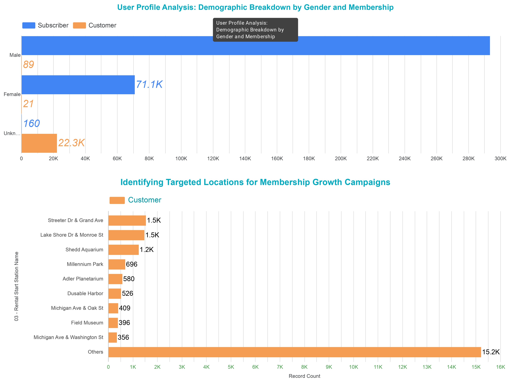

# [🚲 cyclistic-user-conversion-strategy](Images/Bike_Trips_CaseStudy_02162025.pdf)

### A data-driven marketing analysis of Cyclistic bike-share data to optimize user conversion. 
1. 

Project Context: Cyclistic User Behavior Analysis (Q1 2018)
This project analyzes transactional data from the NYC bike-share system during the first quarter of 2018 to identify behavioral triggers for user conversion. By focusing on a period of high operational challenge, the study establishes a baseline for how different segments interact with the fleet, moving beyond external variables like climate to focus strictly on usage patterns.

Key Analysis & Findings
To better understand the conversion path from casual riders to long-term members, the analysis focused on two primary metrics: Demographic Transparency and Temporal Usage Patterns.

The Gender Data Gap:
Initial demographic mapping of the fleet revealed a significant portion of "Unknown" gender entries. Deep-dive filtering showed a direct correlation between missing demographic data and the Customer (casual) segment. In contrast, Subscribers provided consistent demographic profiles, highlighting a lack of engagement data for the very group Cyclistic aims to convert.

Peak Hour Divergence:
Comparative time-series charts reveal distinct "Life-Flow" patterns between the two groups:

Subscribers: Exhibit a sharp peak at 8:00 AM, aligning with traditional corporate commuting schedules.

Customers: Show higher activity during late morning and mid-day hours. This suggests a user base consisting of freelancers, tourists, or workers with non-traditional shifts who may require different membership incentives than the standard "commuter pass."

2.

The Problem Statement
The goal is to differentiate the usage habits of Annual Subscribers and Casual Customers. By identifying where, when, and for how long these two groups ride, we can pinpoint the "Utility-to-Leisure" ratio of the system. This provides a clear roadmap for when to pivot marketing resources from "Retention" (keeping subscribers) to "Acquisition" (attracting new casual riders).

  

